# Restaurant Kitchen Service

Django project for restaurant kitchen management

Project database is arranged according to [diagram](https://dbdiagram.io/d/Restaurant-Kitchen-Service-655d00bc3be1495787750044)

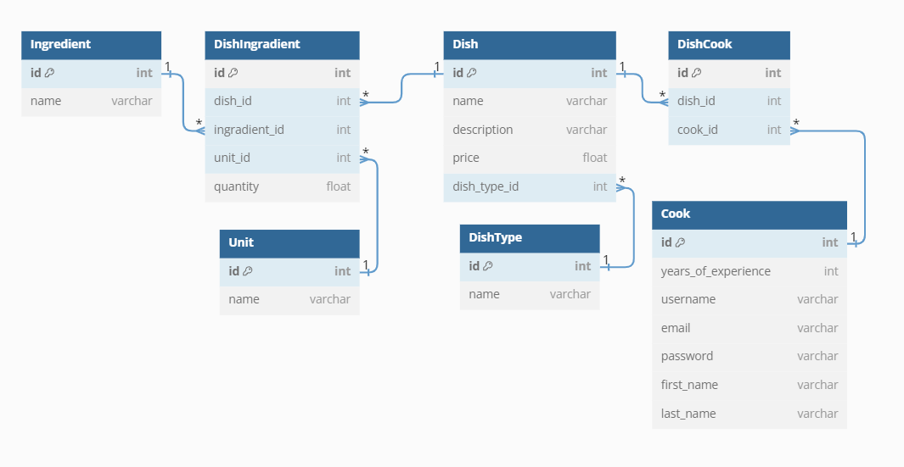

## Check it out

You can use below credentials to login:

username: user

password: 1qazcde3


## Instalation

Pyhton3 must be already installed
```shell
git clone https://github.com/Naz-iv/restaurant_kitchen_service.git
cd restaurant_kitchen_service
python3 -m venv venv
source venv/Script/activate
pip install -r requirements.txt
python manage.py migrate
pyhton loaddata kitchen_service_db_data.json
python manage.py runserver
```

## Features
* Authentication for Cooks/Users
* Managing dishes, dish types, ingredients and cooks using website interface
* Powerful admin panel for admin users

## Demo
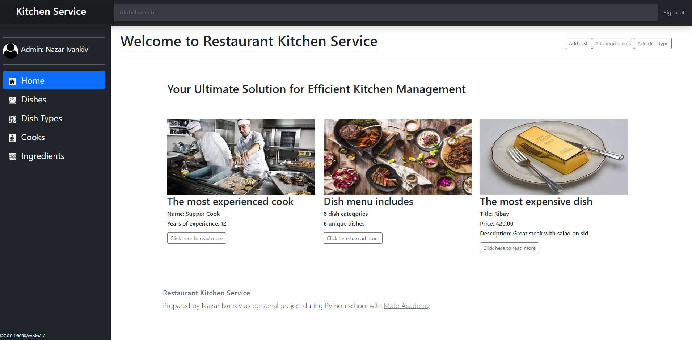
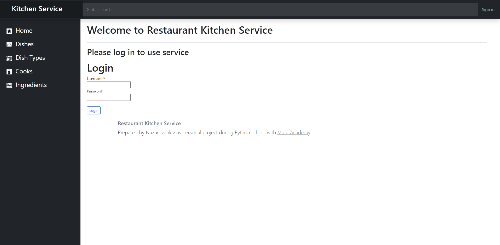
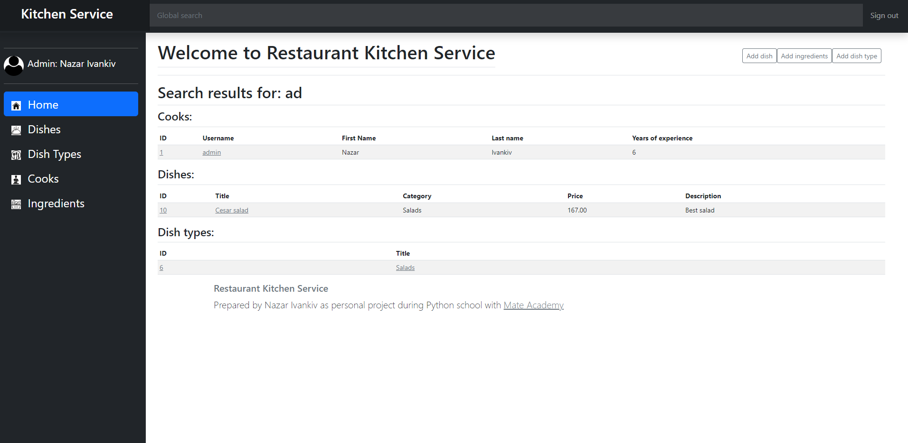
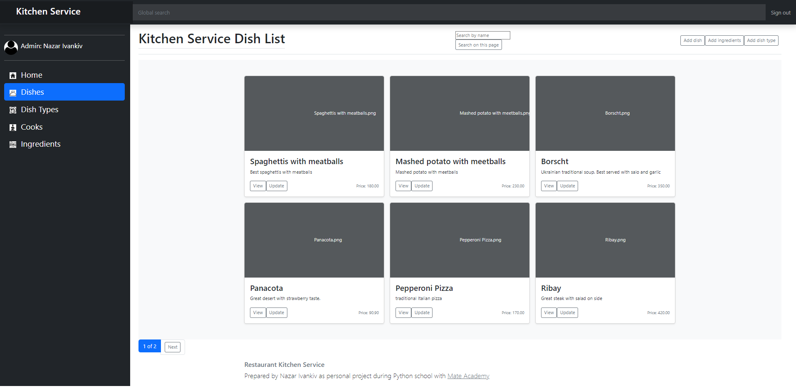
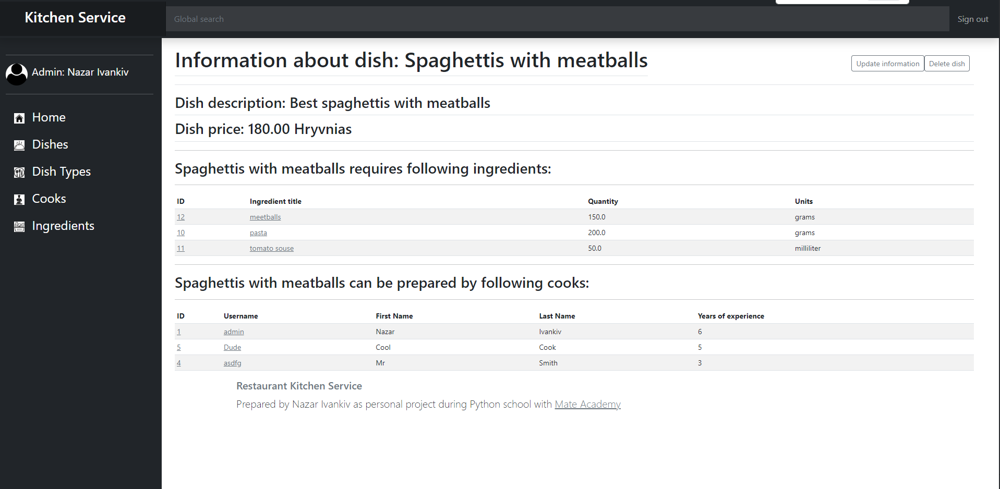
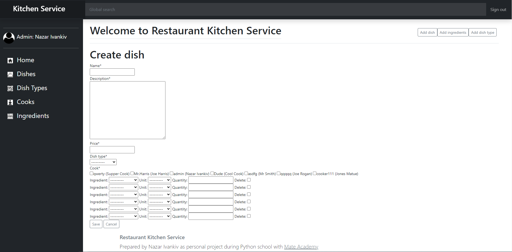

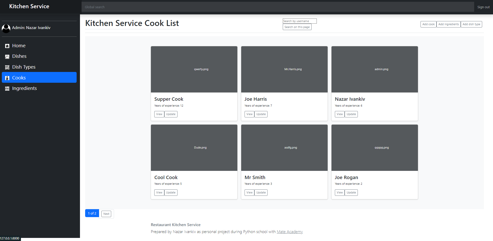
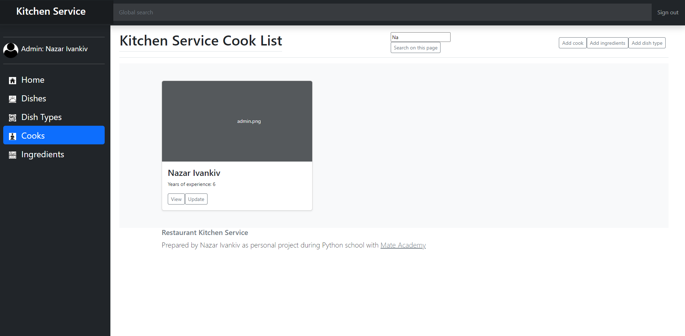
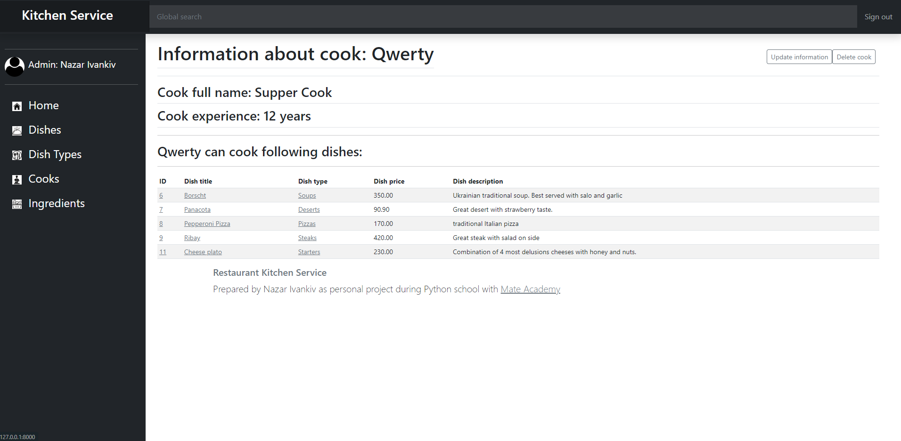
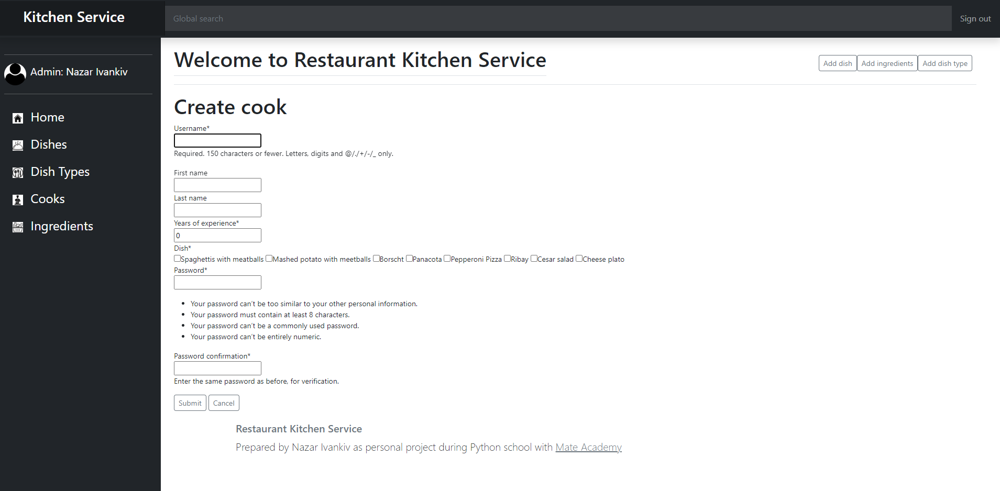
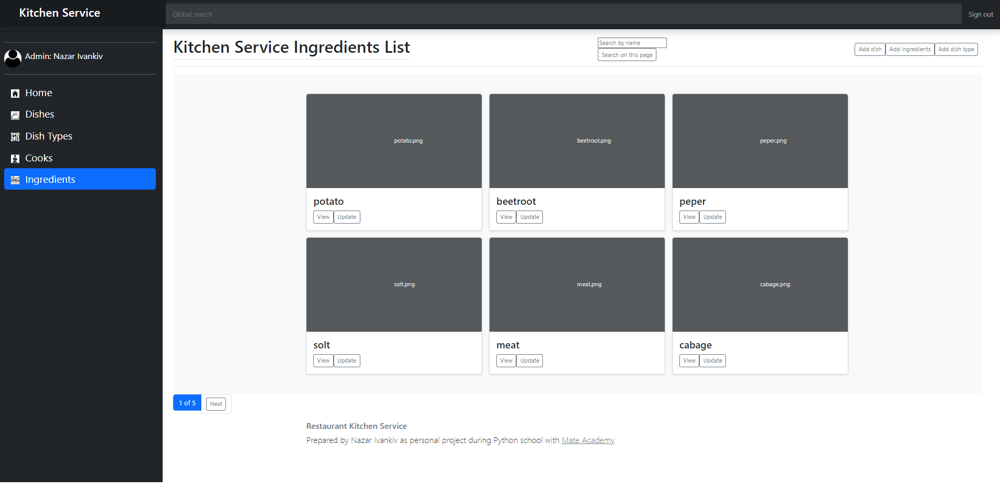
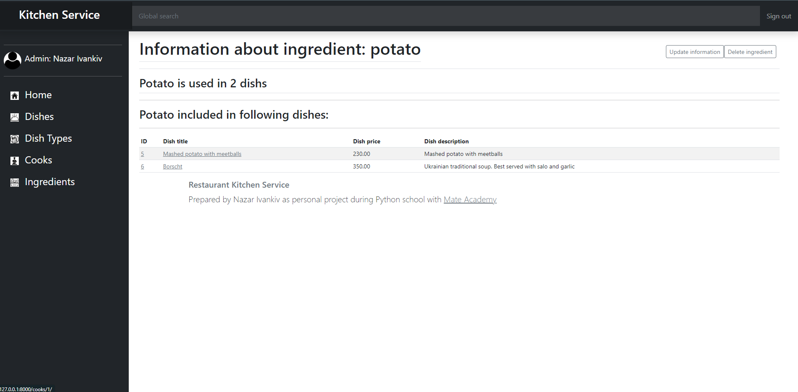
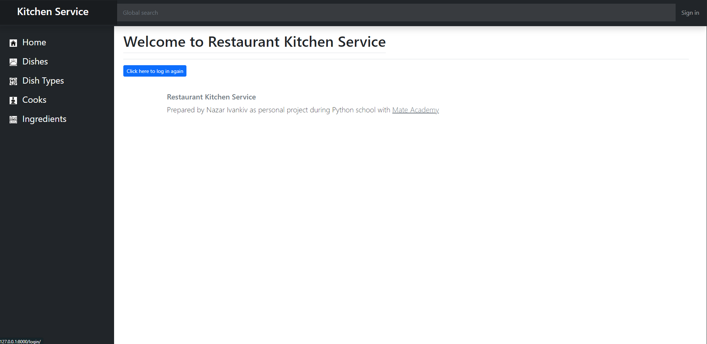


